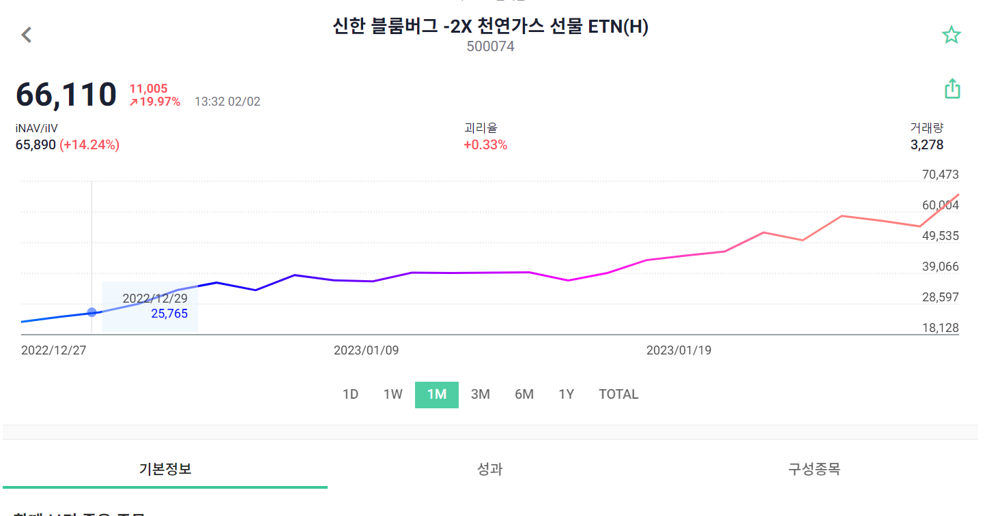

## [QA] ETF_CHECK 오류 및 개선사항 공유

안녕하십니까 안지원 과장님.
신입사원 배영준입니다.
금일 과제에 개선사항 몇가지를 말씀드리겠습니다.

#### ◎ ETF_CHECK 개선 요청(2건)

1.  `구글로그인` 구글 로그인 시 이메일 중복인 경우 validation 체크 필요여부 확인 요청

    - 현재 구글 로그인 상태일시, 아래 이미지의 validation 체크로 구글 로그인이 불가능하기 때문에 개선이 되었으면 합니다.
      

2.  `확대기능` 그래프 확대 기능 추가 요청
    - 모바일 환경에서 그래프를 확대하여 보는 경우가 아주 많습니다. 해당 기능이 추가되면 앱을 사용하는데 더욱 편리할 것 같습니다.
      

감사합니다.
