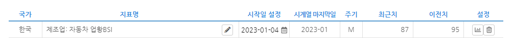
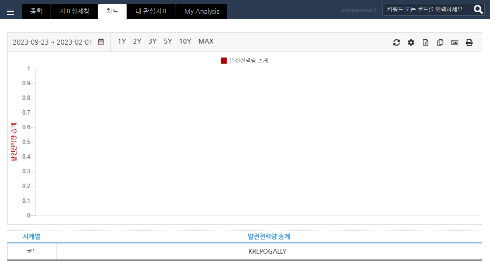
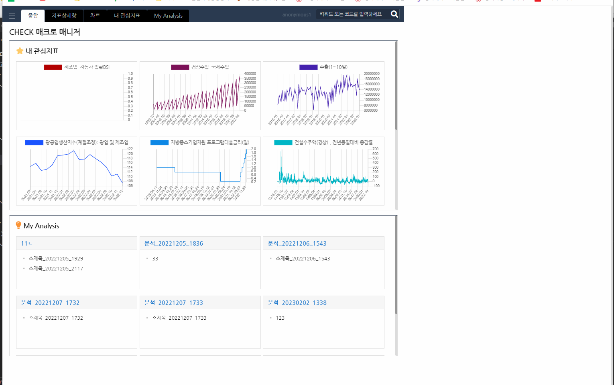

# CheckWeb (TR2001) 버그 및 건의사항

### 1. [버그] CheckWeb 관심지표에서 관심지표 시작일을 미래로 설정시 그래프에서 아무것도 나타나지 않는 현상  
 
 Ex) 시작일을 미래로 설정시  

 

 -> 데이터 날짜의 예외적인 설정값에 대한 처리나 알림이 있으면 좋을것 같습니다.  

 
 -> 마찬가지로 시작, 종료날짜가 뒤바뀔 경우에 대한 예외처리가 필요하다고 생각합니다.  

### 2. [건의사항] 
 
 -> 웹 사이즈에 최적화가 되어있지 않아 크기가 잘 맞지 않습니다.  
    반응형으로 제작하여 사용자나 환경에 따라 변화하게 제작하면 좋을것 같습니다.

