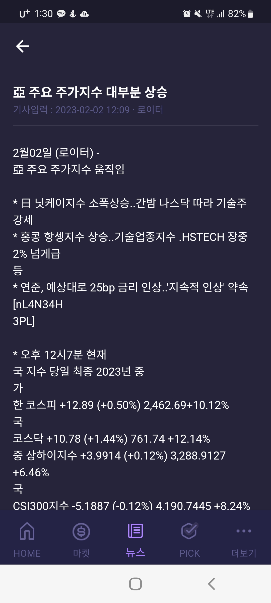
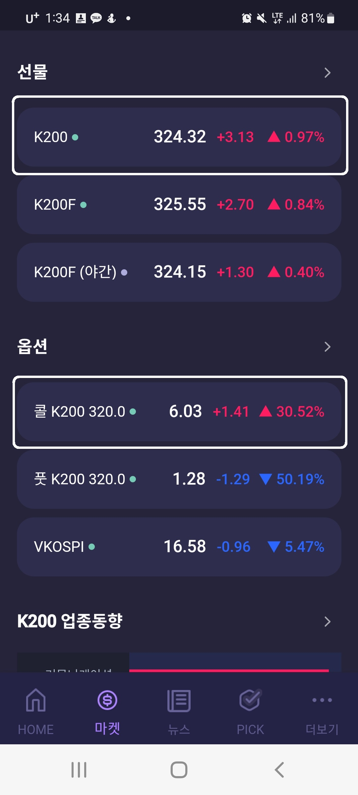

## [개선사항] CheckM+ 오류 및 개선사항 공유

안녕하십니까. HR부 채승훈 사원입니다.
CheckM+의 오류 및 개선 방안을 공유드립니다.

#### ◎ CheckM+ 오류

1.  `뉴스` 간헐적인 화면 레이아웃 오류
    

#### ◎ CheckM+ 개선 요청

1. `차트바` 종목 별 차트 내 터치 시 세로 바 표기

2. `반응속도` 전반적인 어플리케이션 반응 속도가 늦습니다.

3. `마켓` 선물, 옵션 목록 내 li 클릭 시 차트가 바로 보이면 편할 것 같습니다.
   

상기 내용 검토 요청드립니다.
감사합니다.

#

**코스콤 HR부 사원 채 승 훈**

E-mail. shchae822@naver.com

Mobile. 010-7773-6999
