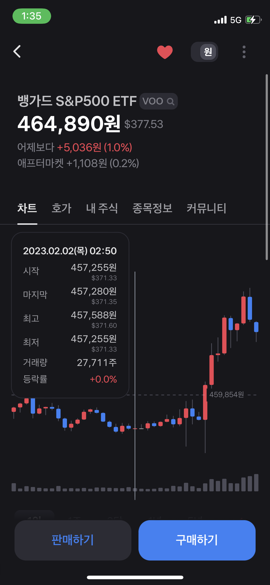

[QA 과제] CHECK m+ 관련 버그 및 개선방안

---------------------
* ###### 버그 발견 : 1개
* ###### 개선 방안 : 1개
---------------------

 

**<버그 상세 설명>**
 
문제 사항 : 일부 상품에 대한 데이터가 없는 경우, 별도의 안내 없이 빈 화면이 출력됨  
해결 방안 : null 또는 undefined 관련 처리가 필요해 보임 

 

**<개선 방안 설명>**
 
특정 시점의 자세한 정보를 차트 상에서 보고 싶은 경우, 
tooltip을 띄워주면 직관적으로 데이터의 변동폭을 파악하기 좋을 것 같습니다. 

토스 증권에서 해당 기능을 제공하고 있으며
차트를 길게 눌렀을 때 해당 tooltip 이 노출됩니다.

