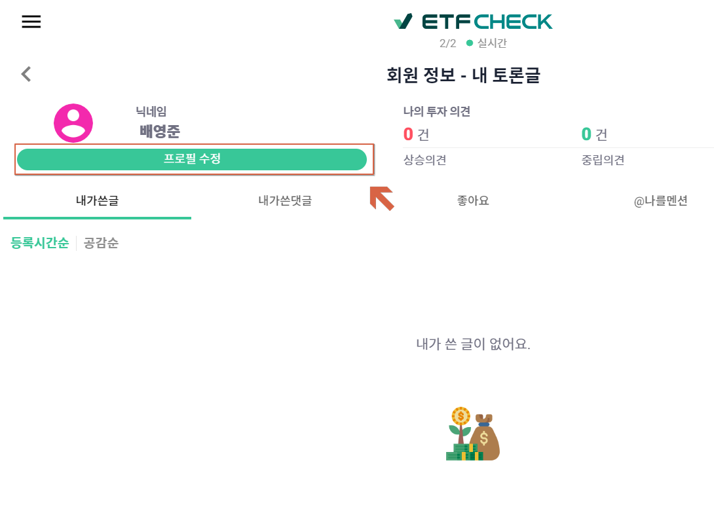

> :point_down:## ETF CHECK 에서 프로필 사진 바꾸는 방법

**0. 로그인을 진행합니다.**

**1. 로그인 직후 프로필을 선택합니다.**

    
**2. 아래 화면의 "프로필 수정" 버튼을 선택합니다.**

    

**3. 본인이 관심 있는 프로필 사진을 선택합니다.**

주의!! 동그라미 아닌 사진을 클릭해야 선택이 됩니다.
이후 저장버튼을 클릭하시면 됩니다.

    

**4. 변경된 프로필 사진을 확인 후 "저장"버튼을 클릭합니다.**

    

**4-1. 변경이 되는 경우 "회원정보가 수정되었습니다." 라는 문구를 확인할 수 있습니다.**

    

**4-2. 변경이 되지 않는 경우 "변경사항이 없습니다." 라는 문구를 확인할 수 있습니다.**

    

**5. 최종적으로 변경된 상태를 확인합니다.**

    

# 수고하셨습니다!!
