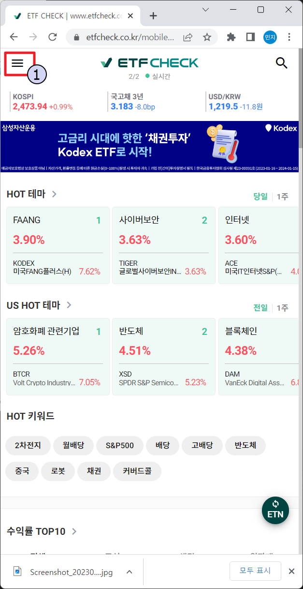
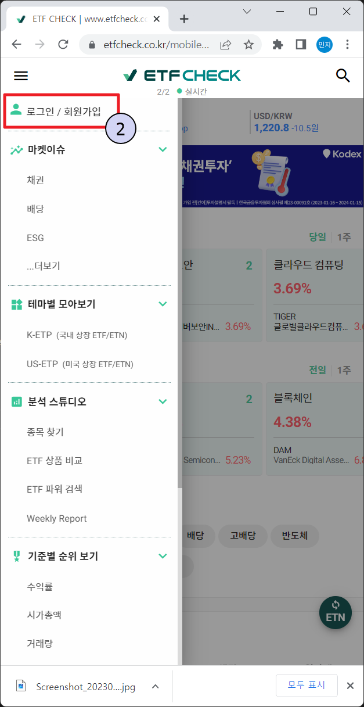
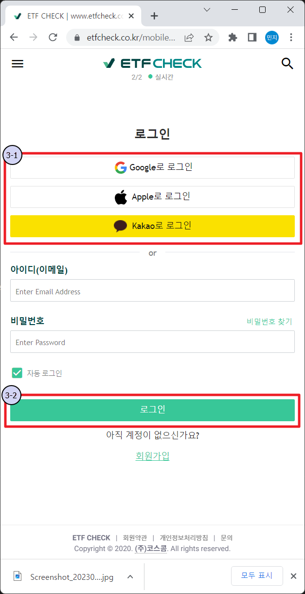
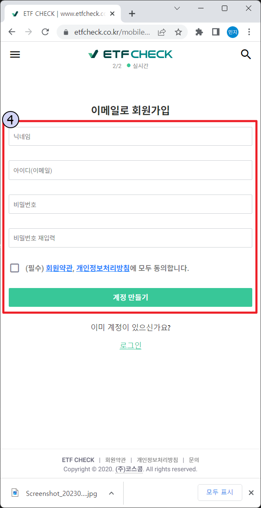
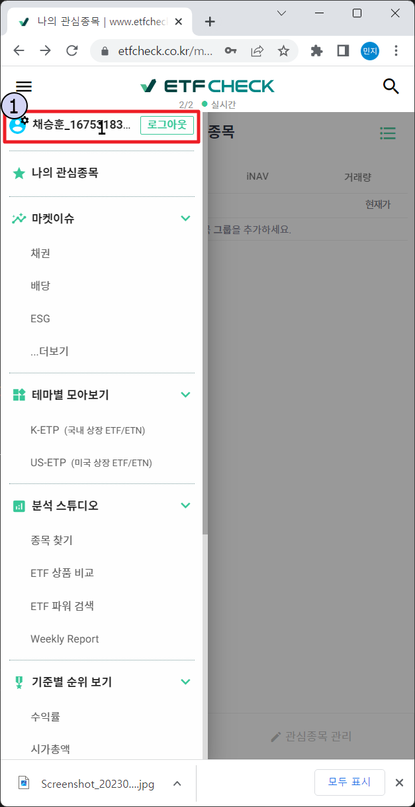
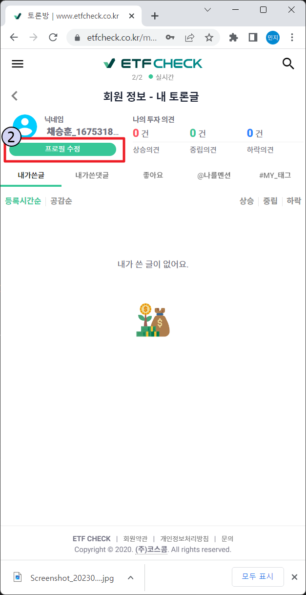
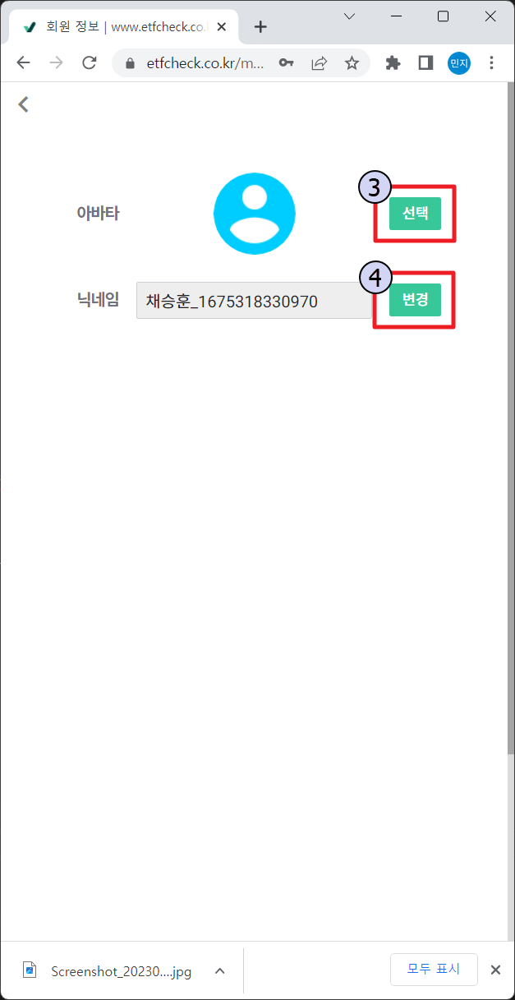

# [과제3] ETF CHECK 가입 및 프로필 변경 매뉴얼

> Author: [HR부] 채승훈\_21451
>
> Created: 2023-02-02
>
> Device : **Samsung Galaxy Note 20+**

---

### ➡️ Step1. ETF CHECK 가입

- 1.  상단 좌측의 아이콘을 클릭한다.
      
- 2.  `로그인/회원가입` 버튼을 클릭한다.
      
- 3.  회원가입을 진행한다.
      > - ① 소셜 아이디가 있으면 소셜 아이디로 로그인한다. (Google/Apple/Kakao)
      > - ② 소셜 아이디가 없으면 하단의 회원가입 버튼을 클릭한다.
      >   
- 4.  이메일로 회원가입 시 회원가입 정보 입력 후 `계정 만들기` 버튼을 클릭한다.
      

### ➡️ Step2. 프로필 이미지 변경

- 1.  좌측 상단 햄버거 버튼을 클릭하고 `내 아이디`를 클릭한다
      
- 2.  `프로필 수정` 버튼을 클릭한다.
      
- 3.  `선택` 버튼을 클릭 후 사진을 고르고 변경 버튼을 누른다
      
