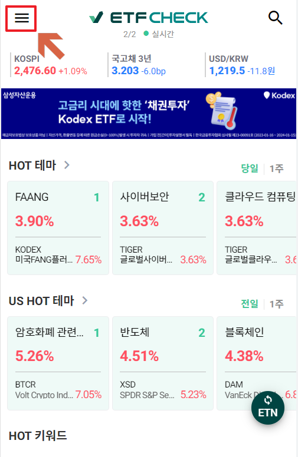
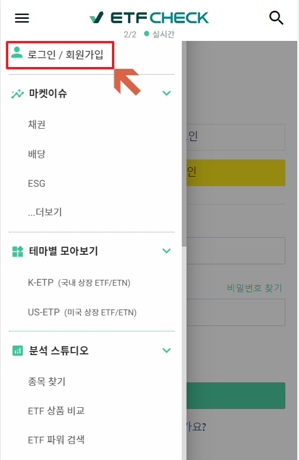
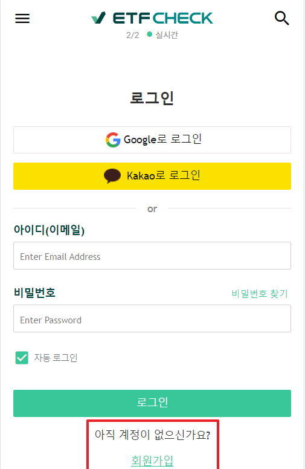
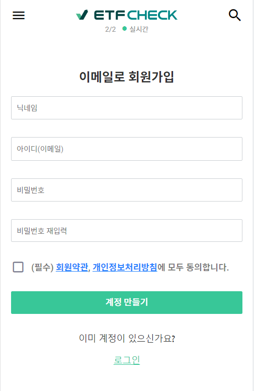
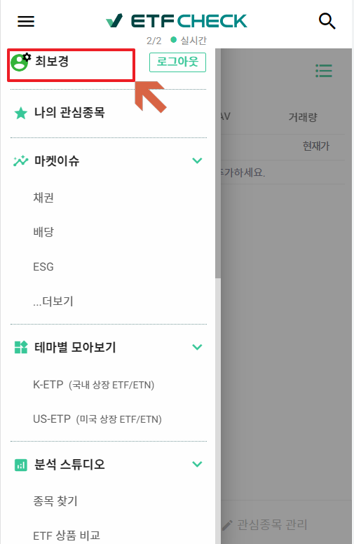
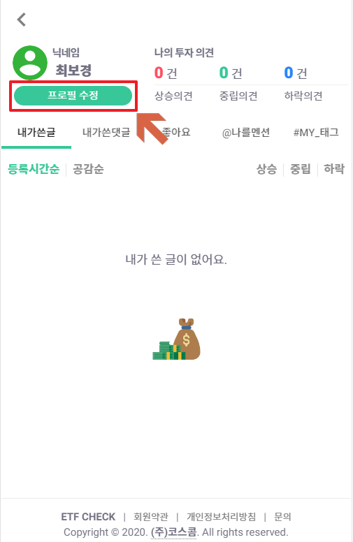
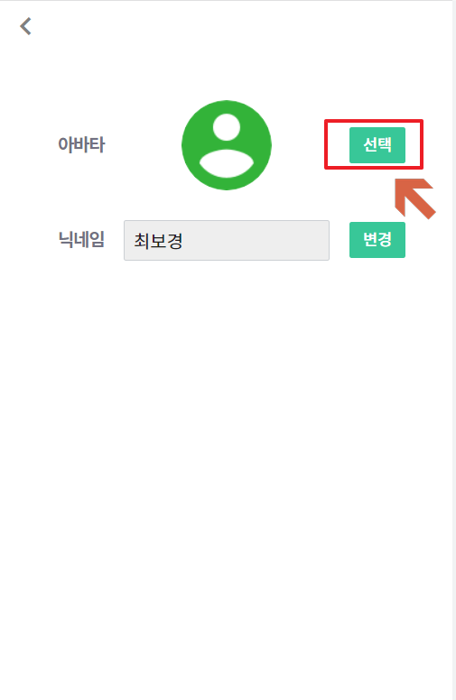
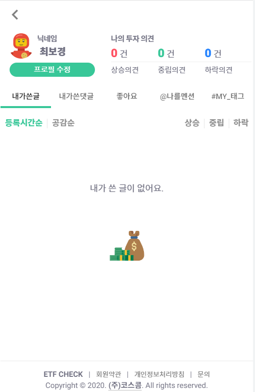

# [매뉴얼 과제] ETF CHECK 가입 및 프로필 변경 

---------------------
### 목차
1. 가입 방법
2. 프로필 변경 방법
---------------------

 
 
### <가입 방법 >
 
| 번호 | 사진 | 설명 |
| ----------- | ----------- | ----------- |
| **1** |  |좌측 상단의 햄버거 메뉴 클릭|
| **2** |  |사이드 메뉴의 "로그인/회원가입" 클릭|
| **3** |  |방법1) 최하단의 "회원가입" 클릭   방법2) 구글 또는 카카오 OAuth 를 이용한 로그인|
| **4** |  |닉네임, 아이디, 비밀번호 입력 후 회원가입 버튼 클릭|

 
 
### <프로필 변경 방법>
 
| 번호 | 사진 | 설명 |
| ----------- | ----------- | ----------- |
| **5** |  |로그인 후, 본 매뉴얼의 `1번` 햄버거 메뉴 진입하여 이름을 클릭 |
| **6** |  |"프로필 수정" 버튼 클릭|
| **7** |  |사진 옆의 "선택" 버튼 클릭 후 이미지 설정|
| **8** |  |본 메뉴얼의 `5번` 단계에서 프로필 이미지가 바뀐 것을 확인|
