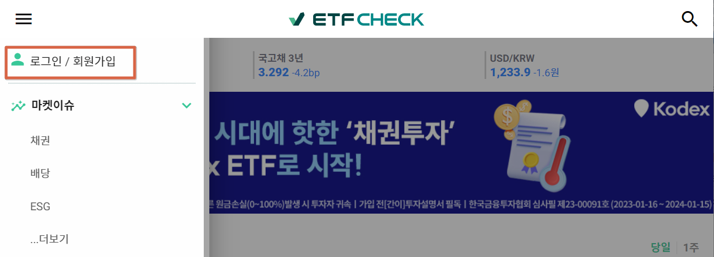
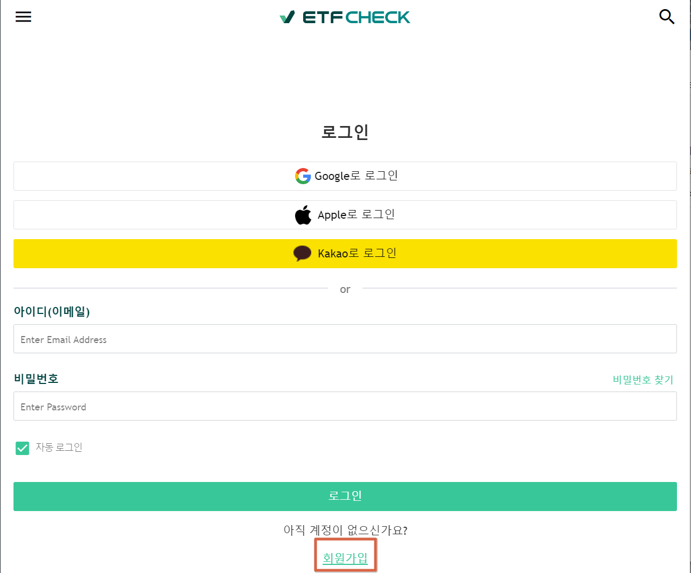
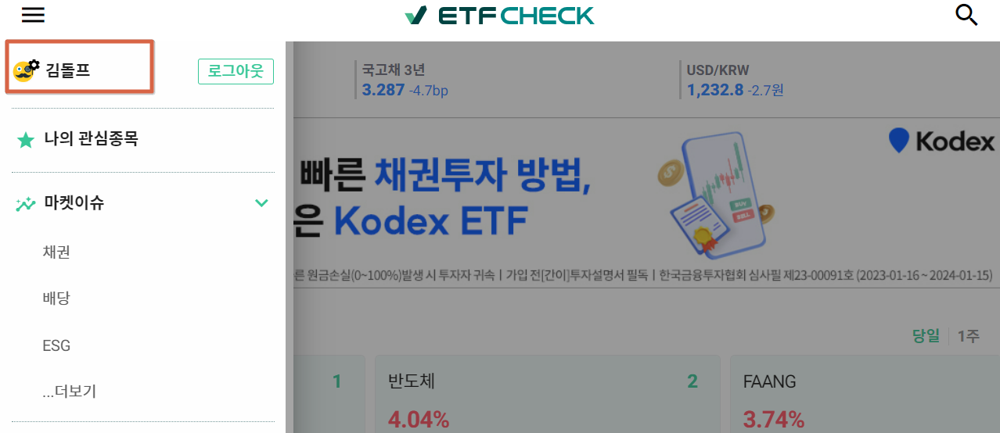
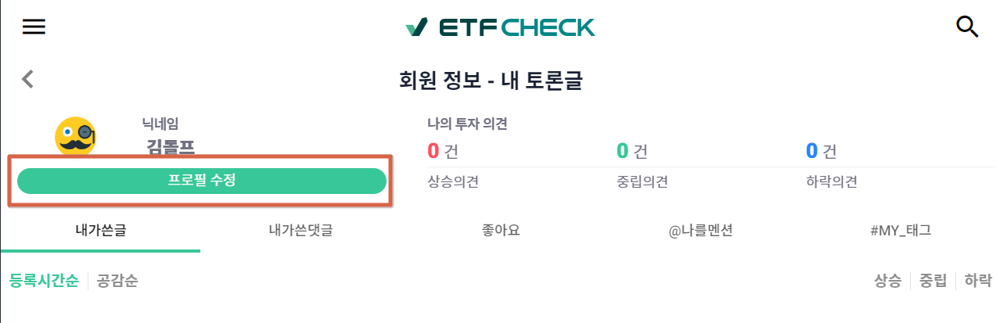
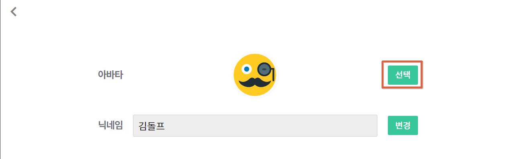
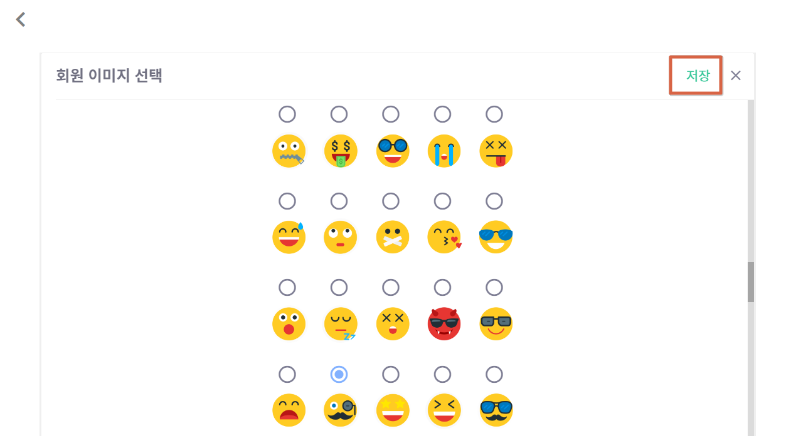

# ETF CHECK 회원 가입과 프로필 사진 변경  

## 회원 가입과 로그인  
### 1. ETF CHECK 접속 ([LINK](https://www.etfcheck.co.kr/mobile/main))
###
  
### 2. 좌 상단 위 메뉴에서 **로그인/회원 가입** 클릭  
###
  

###

### 3. 하단 부분의 **회원가입** 클릭
###

  

### 4. 회원가입 정보 입력
- 닉네임
- 아이디 (이메일)
- 비밀번호
- 회원 약관, 개인정보처리방침 동의
###

    
  
### 5. 이메일 인증메일 수신 후 인증 번호 확인하여 입력
###

    
  
### 6. 가입한 아이디와 비밀번호로 로그인 
###

   

## 프로필 사진 변경
### 1. 좌 상단 위 메뉴에서 프로필 클릭  
###

  
  
### 2. 프로필 수정 버튼 클릭  
###

  
  
### 3. 아바타 오른쪽 **'선택'** 버튼 클릭  
###

  
  
### 4. 변경하고 싶은 프로필 이미지 선택 후 저장  
###

  
    
### 5. 프로필 사진 변경완료  
###

